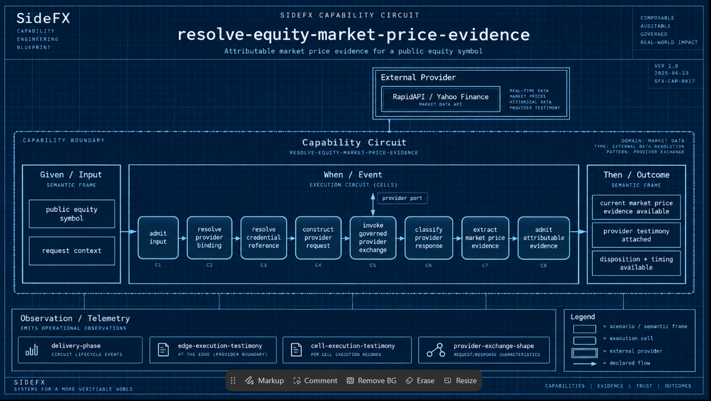

# Capability circuit visual contract

Status: user-aligned presentation target, recorded 2026-09-26. The current
presentation provider does **not** yet meet this contract. This records the
required correction; it does not admit a new estate capability or claim a
completed renderer implementation.

## The reference lens

The user supplied this [blueprint reference](references/capability-circuit-blueprint.png)
and the accompanying [circuit sketch](references/capability-circuit-sketch.txt).
The screenshot is retained unchanged, including its editing toolbar. Its visual
organization is the reference; its eight cells, provider name, dates, identifiers,
and telemetry labels are not verified declarations for the selected estate.
The pasted sketch's unresolved citation markers are not source evidence.

The essential geometry is **one capability boundary containing the scenario's
Given/Input, When/Event, and Then/Outcome**, with the execution circuit inside
When/Event. Provider connections cross the boundary through declared ports.
An observation band below makes the circuit's evidence obligations legible.
The blueprint grid, fine lines, generous frames, readable labels, and restrained
signal colors support that structure; styling alone cannot establish it.

| Region | Meaning and rendering obligation |
| --- | --- |
| Title block | Selected capability identity, declared purpose, source version/digest and projection scope. Retain traceability without substituting presentation ordinals for semantic identities. |
| Capability boundary | The selected capability's governed scope. Multiple scenarios retain their own semantic frames and declared connections; they must not be flattened into an invented single scenario. |
| Given / Input | The admitted state and input contract, explained using linked feature/Gherkin intent. |
| When / Event | The bounded responsibility, opened to reveal execution cells and their declared paths, selections, fan-outs, junctions, convergence requirements and terminals. |
| Then / Outcome | The promised experience and declared outcome variants/products. A provider response or successful operation is not automatically an admitted outcome. |
| Provider boundary | A visible port on the responsible cell, its governed binding and provider realization when known. Forward authority and returning testimony remain distinct. |
| Observation / Telemetry | Declared observation checkpoints and their attribution to cells/edges. Measured status, duration and testimony require an identified invocation overlay. |
| Legend | Explain frame types, cell types, ports, junctions and wire meanings. Color reinforces explicit labels and line styles. |

A straight path is correct when the declarations are straight. The example's
eight-cell path is not an eight-step template for every capability. Branches
must remain branches; multiple alternative routes into one node must not be
drawn as a jointly required convergence.

## Open a cell without changing its meaning

| Semantic altitude | Three-position cell |
| --- | --- |
| Scenario | Input → Event → Outcome |
| Execution | Input → Responsibility → Result |
| Mechanic | Input → Mechanic → Result |
| Provider / physical | Physical Input → Native Operation → Physical Result |

Opening the middle position reveals the lower circuit that fulfills it. Parent
identity, input/result contracts, and the declared descent reference remain
traceable. The overview can use compact execution cells, as in the reference;
detail sheets expose their three positions and descendants. Detail sheets are
projections of the same graph, not separately authored diagrams.

The eleven authoring altitudes provide the capability's deeper context and
intent. They remain in the deck alongside these semantic views; they are neither
eleven execution steps nor a replacement for the circuit. Feature/Gherkin prose
explains the promise and scenarios. Inference may explain supplied facts but
cannot supply missing topology, admission, bindings or proof.

## Wire semantics

* **Solid forward:** declared semantic flow. Preserve the edge's topology,
  selecting outcome variant, contract relation and progress disposition.
* **Dashed descent/binding:** authority crosses into a subordinate cell or
  provider slot. Visual placement above the circuit, as in the reference, does
  not change its semantic altitude.
* **Dotted return evidence:** testimony attributed to canonical cell/edge
  identities. An observation overlay has a separate identity/digest and does
  not alter blueprint topology. A callable subcircuit's result mapping is not
  interchangeable with an observed execution receipt.

Branch selection, jointly required fan-out, convergence, termination and bounded
returns must come from declared semantics. A line crossing is not a junction.
Node degree is not proof of convergence. Alternative provider bindings are not
automatically parallel executions.

Monotonicity concerns semantic progress: narrowing admitted state, establishing
a required product, descending an altitude or terminating an obligation. It
does not mean left-to-right placement, a linear chain or simply an acyclic
drawing. A declared bounded repair/resumption/iteration must show its bound;
it must not be hidden to make the picture appear monotonic.

## What “complete circuit” must establish

1. One capability ID selects the authority and its declared invocation closure.
   Example inputs and prose do not silently add another capability.
2. The whole-circuit sheet preserves every declared route and terminal at the
   selected semantic scope, within the Given/When/Then geometry. Named collapsed
   cells retain all boundary connections and an explicit descendant mapping;
   expansion exposes those descendants without changing identities or paths.
3. Every displayed component, contract, binding and route traces to authority.
   Every authority item in scope maps back to the rendered sheet or an explicitly
   represented subcircuit. Counts over a reduced renderer model are insufficient.
4. Provider slots, physical bindings, branch variants, convergence requirements,
   call/result contracts, observability obligations and available monotonicity
   evidence remain inspectable. Missing required facts produce an explicit gap
   disposition and prevent a claim of completeness; layout cannot fill them in.
5. Planned topology is visible independently of invocation testimony. Unobserved
   paths are not removed or presented as successful. Dynamic targets remain
   explicit unresolved boundaries until separately supported by authority or a
   clearly identified runtime overlay.
6. The entire sheet remains a useful blueprint at presentation scale, with a
   zoomable vector artifact and linked detail sheets for dense circuits. Tiny
   anonymous IDs plus a detached inventory are insufficient as the main view.
7. The same projection and renderer regenerate any supported capability without
   source edits or hand-authored capability-specific slides. The receipt states
   the selected source, scope, gaps and coverage actually verified.

## Current implementation gap

The current `src/capability-presentation/blueprint.mjs` constructs a reduced
scenario/operation graph. It does not consume a complete typed canonical cell
graph. Specifically:

* Scenario inputs carry `eventId` metadata, but there is no explicit Event frame
  containing the responsibility circuit or recursive three-position cells.
* Sequence/completion and generic call-return wires do not establish all typed
  contract/progress/evidence semantics. An empty operation list still receives
  a completion wire; missing authority must not imply fulfillment.
* Transformation IDs are labels on binding nodes, not expanded mechanic cells.
  `snapshot.mjs` retains limited expression previews and only digests/identities
  for edge groups and dispatch authorities.
* Junction marks are selected using connection counts. They do not demonstrate
  declared fan-out or complete convergence requirement sets.
* Binding nodes do not provide the reference's full provider-boundary structure;
  the overview has no observation band with per-cell obligation attribution.
* Existing coverage checks verify the reduced model's own nodes and edges. They
  do not prove complete canonical authority coverage or monotonicity.

The current slide title “Complete capability circuit” therefore overstates the
result. The generated decks remain existing artifacts of that implementation;
this documentation change does not regenerate or repair them.

The correction starts with a lossless typed authority/view adapter, then the
nested frame and wiring renderer, then generic regeneration and visual/source
coverage verification. Investigate the existing `read-capability-circuit` and
compiled planned-cell/edge surfaces before introducing another graph model.
Their current payload fidelity must be checked, not assumed from historical
implementation notes. The hand-authored provider remains the authorized bridge
until its later migration into the declared estate.

## Architecture sources inspected

These are source documents, not additional user instructions or proof of current
live estate contents:

* `bpm/intelligence/backup/agentic-harness/docs/adr-001-design-identity-capability-capsules.md`
  (archived copy, header “Accepted”): three-position cells at lines 777–780;
  branching/convergence and progress at 867–966; authority/evidence at 970–994;
  geometry and edge/view laws at 2453–2501. The archived location is intentional;
  a corresponding file was not present under the main `intelligence/docs` path.
* `sfx-embody/docs/circuit-view-flywheel.md`: generic projection over declared
  topology, with testimony overlay and explicit planned/unobserved state.
* `sfx-embody/docs/implementation-plan-circuit-view.md`: `circuit-view.v1` nodes
  and edges, source reuse, and recorded implementation/attestation limitations.

The user's screenshot establishes the visual lens. These documents substantiate
the semantic distinctions that the reusable provider must preserve.
