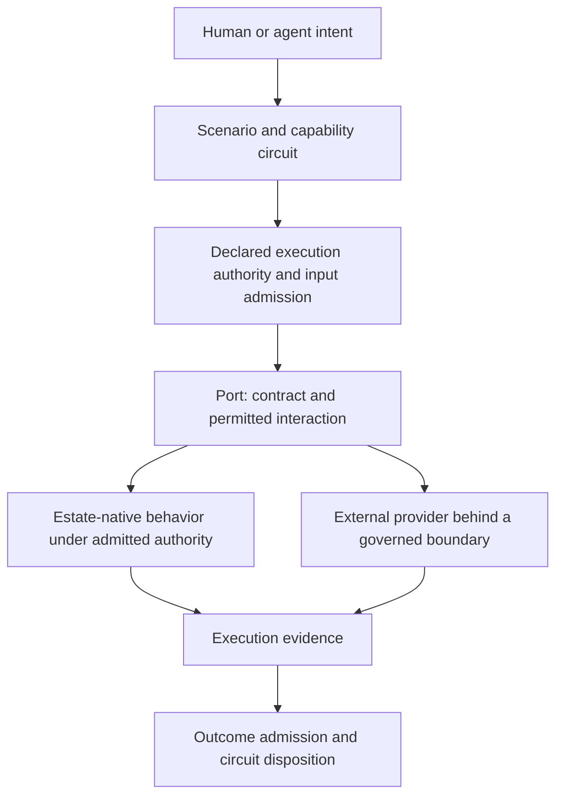

# Modernization as an observable property of the capability estate

**Date:** 2026-09-23. **Status:** Architecture and operating-model proposal,
grounded in the repository at revision `67cfb50`; no live estate audit performed.
**Source:** The architecture discussion supplied on 2026-09-23, beginning
"Yes. This is much deeper than a modernization strategy in the conventional sense."
This document develops that discussion into a durable architectural statement.

## 1. The architectural claim

Modernization can be represented as an evidence-backed movement of execution
responsibility into the capability estate. The central question is:

> Where does execution authority for this capability reside, and which portions
> of its execution are governed by the estate's declared meaning?

Code age, language, deployment platform, and legal ownership remain useful facts.
They do not answer that question. A recently written enterprise service can keep
business rules outside estate authority; an established capability can express
those rules as admitted declarations.

The modernization boundary is the **capability estate**. An application is
examined as a collection of scenario and capability dependencies. The unit of
change is a meaningful scenario slice and its execution responsibilities, even
when that slice crosses application boundaries.

| Conventional inventory question | Capability-estate question |
| --- | --- |
| Which technology is old? | What capability and scenarios does it serve? |
| Should this application be rewritten? | Which execution responsibilities should move into estate authority? |
| Can it move to a new platform? | Would that change where its meaning and execution choices reside? |
| Which services call it? | Which circuit paths depend on its provider binding? |
| Is it deterministic? | Which portions are repeatable under which declared conditions and authority? |

Once dependency selection, authority, and execution evidence are linked, the
architecture can report its modernization state. That claim is conditional:
declared topology shows intended execution; observed, version-linked testimony
establishes what actually ran. Missing evidence remains unknown.

## 2. The estate boundary

The estate owns declared meaning: objectives, capabilities, scenarios, input and
outcome contracts, permitted operations, transformations, bindings, and the
conditions under which results are accepted. It can govern an interaction while
the implementation performing it remains outside that authority.



This is a conceptual interaction model, not a new port type or a claim that every
installed circuit implements all these gates. A native branch may itself invoke
external providers. Expand its dependency closure before describing the whole
circuit as native.

### Vocabulary

| Term | Meaning in this model |
| --- | --- |
| Capability | A declared ability to produce a meaningful outcome under stated conditions. |
| Scenario | An explicit input/event/outcome relationship, including relevant refusals and failures. Given/When/Then is one expression of it. |
| Circuit | The composed execution topology serving a capability or objective, including conditional, alternate, and nested dependencies. |
| Port | A declared interaction boundary specifying the contract and permitted execution responsibility. |
| Provider | An implementation selected to satisfy a declared responsibility. The role alone says nothing about ownership or native status. |
| Execution authority | The admitted declaration determining what may execute, how it composes, and how its outcome is evaluated. |
| Estate-native behavior | Behavior whose relevant meaning and execution choices are carried by admitted estate authority and resolved through the declared circuit. |
| External-to-estate behavior | Behavior whose internal decisions remain in a provider implementation outside that authority, even when invocation is governed. |
| Boundary governance | Control over admission, selection, invocation, evidence handling, and acceptance at the interaction boundary. |
| Estate sovereignty | The scope of meaning and execution responsibility the estate can declare, constrain, inspect, and change; a scoped architectural claim. |
| Absorption | Transfer of a specified execution responsibility into admitted estate authority, supported by evidence. |

The source discussion uses *admitted capability capsule* for a native embodiment.
In the current row-driven estate, the concrete destination is versioned declared
authority/data interpreted by the kernel. A capsule is not a requirement to
generate or retain executable files. The sibling estate's
[target architecture](../../sfx-embody/docs/target-architecture.md) is the reference
for that realization.

### Ownership and authority are independent

| Implementation | Ownership | Relationship to estate authority |
| --- | --- | --- |
| Legacy Java service | Enterprise | External where business decisions remain inside the service. |
| Newly written enterprise module | Enterprise | External where handwritten behavior supplies meaning outside declarations. |
| Library maintained by another organization | Third party | External for behavior delegated outside admitted semantics. |
| SaaS payment or CRM service | Third party | External execution behind a potentially governed interaction. |
| Admitted scenario and transformation resolved by the kernel | Depends on deployment | Native for the declared behavior; remaining provider dependencies stay visible. |

Source availability, physical location, API wrapping, and ownership do not
independently establish native status. Nor does runtime code make every
capability external: the kernel and admitted platform mechanics ground
declaration execution. The question is whether domain meaning is controlled by
declarations or hidden in a bespoke implementation.

Older code can participate through declared, bounded mechanics. Putting an
unchanged opaque domain engine behind a binding establishes boundary governance;
it does not absorb the engine's internal rules.

## 3. Governance can precede replacement

Consider a legacy pricing engine with years of accumulated rules. The first
useful step can preserve the engine:

```text
Pricing scenario
  -> resolve-price capability
  -> declared PricingPort
  -> LegacyPricingEngine
  -> provider evidence
  -> admitted price outcome or declared refusal
```

The estate can identify the requested meaning, selected provider, permitted
interaction, and required evidence. Characterization can begin before a
replacement is feasible. The honest claim is: **the estate governs its
interaction with the provider; the provider's internal execution remains
outside that authority.**

| Stage | What can be declared and checked | What it does not establish |
| --- | --- | --- |
| Intent and scenario selection | Objective, eligible scenario, selected authority version | Complete knowledge of legacy behavior. |
| Input admission | Shape, required context, allowed values and scope | Correct use of every input inside the provider. |
| Provider invocation | Binding, operation, effect scope, credentials, timeout and retry policy where supported | Control over unobserved internal calls or decisions. |
| Evidence capture | Correlation, response, failures, timing, provider/version where observable | Independent truth of provider testimony. |
| Outcome admission | Shape, domain predicates, testimony, freshness and correlation | Business correctness merely because JSON conforms. |
| Disposition | Accepted outcome, hold, rejection, or other declared result | Reversal of an external effect already performed. |

These are design responsibilities. Each deployed circuit needs evidence of which
controls it actually enforces. A provider's success status is input to the
circuit's decision, not authority to admit its own outcome.

Declaring an external dependency improves visibility and controllability before
absorption occurs. Report that progress separately from movement of internal
execution authority.

## 4. Determinism has topology

Determinism concerns repeatability under specified inputs, state, versions, and
effect assumptions. Estate authority concerns who declares and constrains
behavior. A legacy calculator can be repeatable while remaining external. A
native workflow can govern a probabilistic model, changing database, or remote
service without making that dependency deterministic. Native execution also
requires explicit treatment of clocks, randomness, concurrency, and state.

Assess each responsibility along five separate axes:

1. **Meaning:** Are its scenario and acceptance conditions declared?
2. **Boundary:** Are selection, invocation, and outcome admission governed?
3. **Internal authority:** Is behavior native, external, mixed, or unknown?
4. **Repeatability:** Under which conditions has repeatability been shown?
5. **Evidence:** Which observations support the claim, for which versions and
   scenario population?

An illustrative five-dependency circuit makes the distinction concrete:

| Responsibility | Internal authority | Boundary | Repeatability qualification |
| --- | --- | --- | --- |
| Identity resolution | Native | Governed | Depends on declared identity inputs and state. |
| Customer lookup | Native | Governed | Replay requires a pinned data snapshot. |
| Credit decision | External, enterprise legacy | Governed | Boundary evidence does not establish internal behavior. |
| Fraud scoring | External, third-party model | Governed | Inference may vary; evaluate under declared criteria. |
| Notification orchestration | Native | Governed | Delivery may still require an external transport. |

At this level of decomposition, three of five responsibilities are native:
**60% native execution-authority coverage at that scope**, not "60%
deterministic." If notification delivery includes an SMS provider, expand the
graph and disclose it; the five-row view is not an end-to-end inventory.

Deterministic admission around an external decision does not make the decision
itself deterministic. A topology view should show where estate authority stops,
where evidence becomes provider testimony, and where claims remain unknown.
The [evidence model](modernization-evidence-model.md) preserves these distinctions
instead of treating a single deterministic factor as a universal quality score.

## 5. The scenario is the migration unit

An application may perform twenty functions while three justify near-term
change. Start from their meanings:

```gherkin
Scenario: Evaluate customer eligibility
  Given customer account data under a declared policy version
  When eligibility is evaluated
  Then an eligibility outcome and supporting evidence are returned

Scenario: Resolve an applicable price
  Given an eligible customer and a declared pricing context
  When pricing is requested
  Then the applicable price and its basis are returned

Scenario: Confirm a completed transaction
  Given a completed transaction
  When confirmation is required
  Then confirmation delivery evidence or a declared failure is returned
```

These examples do not declare capabilities. Each scenario can be governed,
characterized, and migrated independently when its actual state and transaction
dependencies permit. Shared mutable state, hidden calls, and coupled effects may
require a larger slice. The meaningful boundary determines the migration unit.

```text
Human objective -> scenario -> capability -> circuit -> port -> provider -> implementation
```

Reuse an existing capability where possible, compose established capabilities
next, and author a new identity when required meaning is absent. Preserve
scenario identity through replacement when meaning is unchanged. Version the
meaning and contracts explicitly when intended behavior changes.

The approach is compatible with facades, ports and adapters, anti-corruption
boundaries, and incremental replacement. Its emphasis is the explicit chain from
scenario meaning through execution authority to evidence and disposition. A
forwarding adapter supplies a boundary; the authority and evidence records
establish what has actually moved across it.

## 6. Absorption is a progression

```text
Unknown dependency
  -> declared external provider
  -> observed provider
  -> characterized capability
  -> candidate embodiment
  -> parallel or shadow evaluation
  -> admitted estate capability
  -> old provider retired or retained as an explicit alternate
```

Each transition requires evidence. A characterized dependency may remain
intentionally external. Admission and production selection are separate facts:
an admitted candidate does not own production execution until routing is selected
and verified. Partial rollout and rollback remain visible.

Observation connects legacy use to understanding. Examples, failures, business
review, and scenarios help establish replacement obligations. Historical behavior
is evidence, not automatically the specification: a legacy defect must not become
a required rule merely because it appears frequently. The
[playbook](capability-absorption-playbook.md) defines transition criteria,
comparison, effect isolation, cutover, and retirement proof.

## 7. External dependency can be intentional

Payment services, cloud platforms, messaging providers, and specialized models
may be correct continuing dependencies. Full internal ownership of everything is
not the objective. Record selection rationale, governed interaction, evidence
appropriate to the claim, and a review policy.

| Dimension | Example values |
| --- | --- |
| Ownership | Enterprise, third party, shared, unknown. |
| Implementation posture | Legacy service, current service, library, SaaS, model, declared behavior. |
| Estate relationship | Native, external, mixed, unknown. |
| Strategic intent | Intentional external, temporary bridge, candidate for absorption, undecided. |
| Constraints | Required, replaceable, contractual or operational restriction. |
| Migration progress | Observed, characterized, candidate, evaluating, admitted, partially selected, retired. |

These are proposed vocabulary examples, not installed enums. An intentional
external dependency can still carry operational exposure. Externality alone does
not establish technical debt or justify replacement.

## 8. Architectural pressure comes from evidence

Consider a hypothetical eligibility capability with 8.3 million executions per
month, a critical legacy dependency, high observed failure exposure, 97% coverage
of a named scenario catalogue, and an available native candidate. This supports
investigating absorption. It does not prove readiness or economic justification.

Connect volume, criticality, incidents, latency, cost, semantic understanding,
candidate quality, and transition cost. The uncovered 3% may include the most
consequential cases. Volume-weighted scores can hide rare severe failures.

The estate exposes pressure while leaving the response explicit: improve the
boundary, characterize missing behavior, accept externality, change provider, or
absorb a responsibility. Record rationale, owner, evidence, and revisit condition.

## 9. The Capability Alignment Circuit and AI

AI can reason over a declared modernization surface: the requested capability,
existing scenarios, providers, authority gaps, behavior, alternatives, and proof
still needed. Its useful output is a proposal linked to evidence.

```text
Intent and bounded estate context
  -> reuse / composition / candidate proposal
  -> alignment evaluation against meaning, authority, and proof obligations
  -> governed review and repair
  -> proof and admission
  -> selected execution
  -> evidence and reusable learning
```

Models can propose characterization, fixtures, declarations, and priorities.
Admission authority remains with the declared governance process and authorized
decision makers. Provider text and model output are evidence or candidates;
neither can grant itself permissions or rewrite acceptance criteria.

Bound context and proposal effort, preserve provenance, and retain named findings.
A generated test suite is not independent proof if it merely restates the same
model's implementation. Compare against declared outcomes, independently reviewed
examples, and observations with known limitations. Prove the scope before promotion.

The sibling [authoring/evaluation circuit discussion](../../sfx-embody/docs/capability-authoring-evaluation-circuit.md)
provides conceptual background, not proof that all stages are installed.

## 10. Application to this repository

The eleven authoring-altitude services implement candidate construction in code
while declared-data successors are introduced. Their deletion target is local
and specific; it does not require every estate provider to disappear.

| Repository evidence | Interpretation |
| --- | --- |
| [Bridge policy](../bridge.policy.json): immutable baseline of eleven, closed surface. | This bridge must shrink toward zero; the broader model does not authorize adding providers here. |
| [Swap-in map](swap-in-map.md): zero retired, eleven remaining, dated 2026-09-22. | Historical recorded baseline, not a fresh runtime measurement. |
| Policy records counterparts for altitudes 1 and 8. | Availability is distinct from completed replacement; prerequisites, placement, and invocation proof still matter. |
| [Bindings record](../bindings/README.md): eleven documents authored, nothing installed in that record. | Policy admission and authored bindings do not prove live installation or selection. |
| [Request validator](../src/request-contract.mjs): compact shape and size bounds; contract metadata is `PROPOSED`. | Local validation and estate contract admission are separate. |
| [Server](../server.mjs): candidate shape checks and `AUTHORED`/`HELD` responses. | Provider-local status and schema conformance do not establish estate admission or business correctness. |
| Successful optional model calls add `canned.modelOutput` and set `providerExecution: "model"`; failures retain stub execution with diagnostics. | Deterministic coded construction does not make attached model output deterministic or admitted. |
| Services do not install estate rows or write estate receipts. | They propose output; authority transfer requires the estate's admitted change lifecycle. |

`PROVIDER_BRIDGE_GROWTH_REFUSED` and `PROVIDER_BRIDGE_SUCCESSOR_OVERDUE` name
required policy dispositions. This documentation does not establish runtime
enforcement for them. The local server is not an implementation of the proposed
modernization dashboard or lifecycle.

A successor may remove handwritten orchestration while still calling an external
model through a declared route. That advances authority over orchestration;
inference remains external. Retirement counts cannot stand in for whole-circuit
native coverage or determinism.

## 11. Continuous modernization

An evidence-backed estate view should answer:

- What meaning is declared, and which scenarios depend on it?
- What is selected, and what actually ran?
- Which responsibilities are native, external, mixed, or unknown?
- Where do evidence and declared conditions support control and repeatability?
- What changed between versions, including partial migrations and reversals?
- What can be absorbed, and what should intentionally remain external?

Continuous modernization is the recurring practice of answering these questions
and acting on the evidence. The executing estate can demonstrate its
modernization state when declarations, selection history, and testimony support
the claim. The evidence model and playbook make those obligations explicit.
